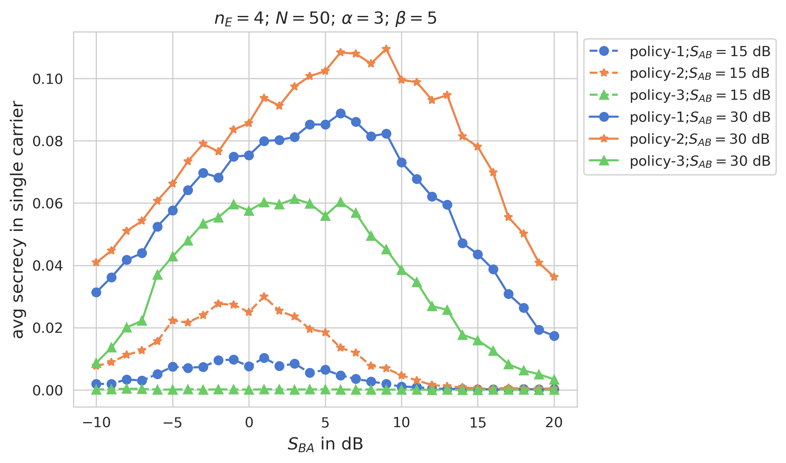
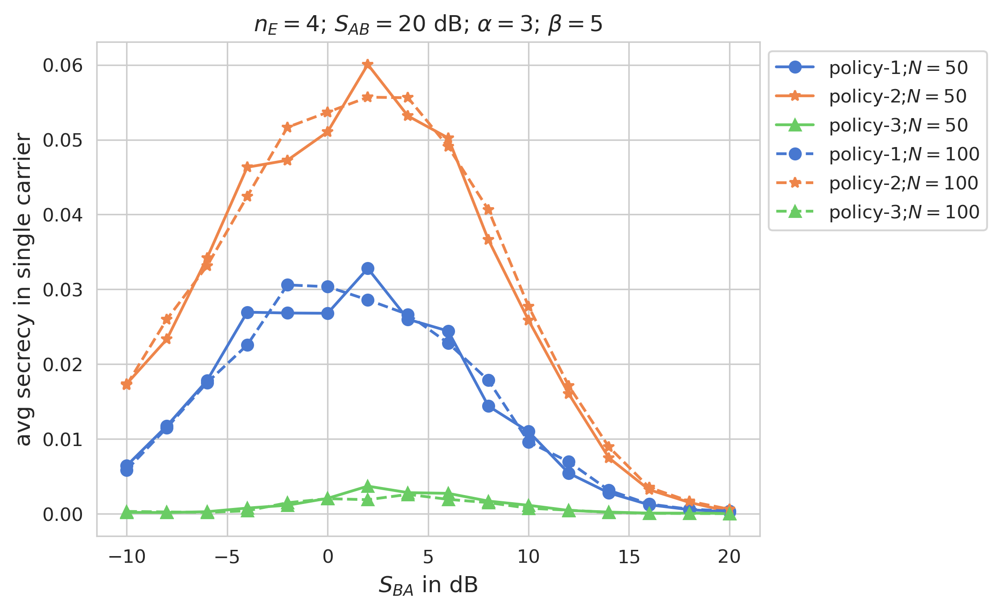
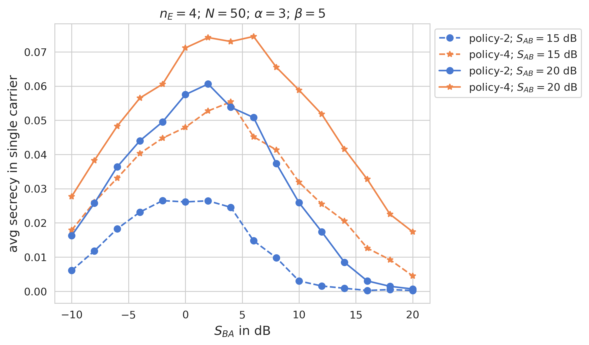
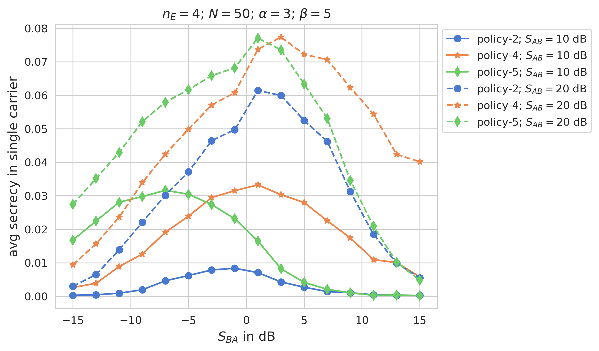

## Introduction
The project explores the application of the [STEEP](https://arxiv.org/pdf/2309.14529) (Secret Transmission by Echoing Encrypted Probes) protocol for secure multi-carrier communication (MC-STEEP) between two single-antenna nodes in the presence of a multi-antenna eavesdropper. STEEP is a two-phase round-trip communication scheme designed to achieve positive secrecy rates in static non-reciprocal channels. This work focuses on optimizing MC-STEEP by proposing pairing and power allocation policies that significantly enhance the Average Achievable Secrecy Rate (AASR).

## System Model and Policies
The system model considers Alice and Bob communicating over multiple carriers $N$, with probing in phase-1 and echoing in phase-2. It also incorporates an eavesdropper with $n_E$ antennas and channels, modeled as non-reciprocal with i.i.d. complex Gaussian fading. The carriers from Alice to Bob are denoted as probe-carriers ($h_{BA,n}$), and carriers from Bob to Alice are denoted as echo-carriers ($h_{AB,n}$). As STEEP is a round-trip scheme, i.e., it uses a probe-carrier for phase-1 and then an echo-carrier for phase-2, we can explore how the pairing of these (probe and echo) carriers affects the AASR. For example, for $N=10$, there are $[h_{BA,1},\cdots,h_{BA,10}]$ and $[h_{AB,1},\cdots,h_{AB,10}]$ as probe and echo carriers. Please note that these $h$ quantities are i.i.d. complex Gaussian. We denote policy-1 as 'no pairing', where the carriers are paired as it is, without using any processing/sorting. Then we denote policy-2 as 'similar sorting', where we pair the strongest (highest SNR) probe-carrier with the strongest echo-carrier and so on. Finally, we denote policy-3 as 'reverse sorting', where we pair the strongest probe-carrier with the weakest (lowest SNR) echo-carrier and so on. In the below figure obtained from 'test_1.py', we can see the performance of the policies, where the policy-2 performs best. 

We also show AASR for different carrier numbers in the figures below by running 'test_2.py'. 

Now we perform resource allocation (power scheduling) over policy-2. First, we perform power allocation to maximize AASR at Bob, which we denote as policy-4. Then we perform power allocation at Alice on top of policy-4, which we denote as policy-5 (plot obtained by 'test_3.py' and 'test_4.py').  

We can see that policy-4 significantly increases the AASR compared to policy-2. The policy-5 does not increase the AASR compared to policy-4, but it achieves the same AAASR as policy-4 with less power at Alice.
