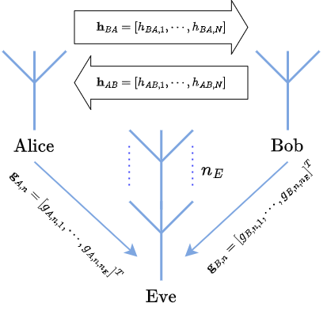
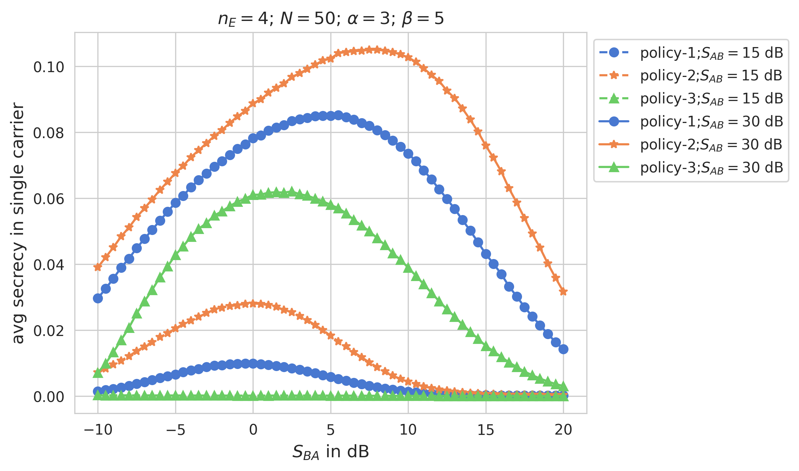
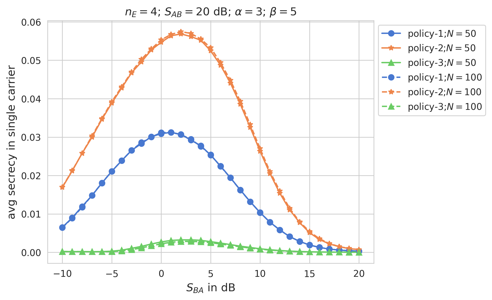
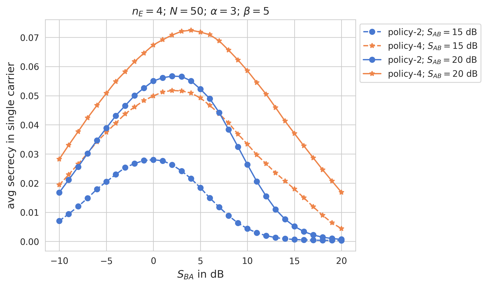
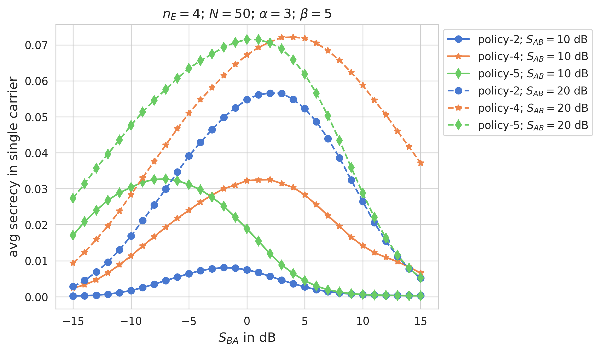
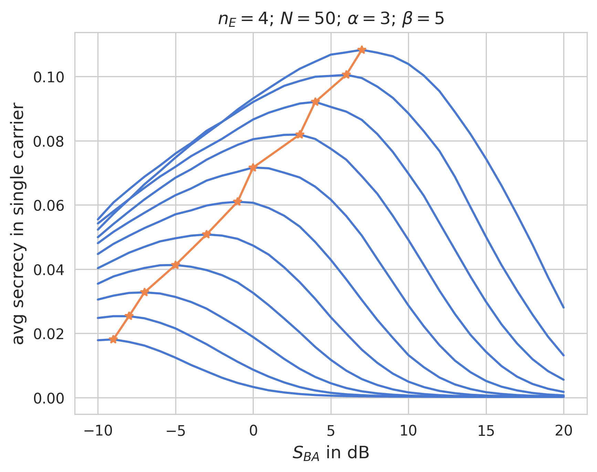
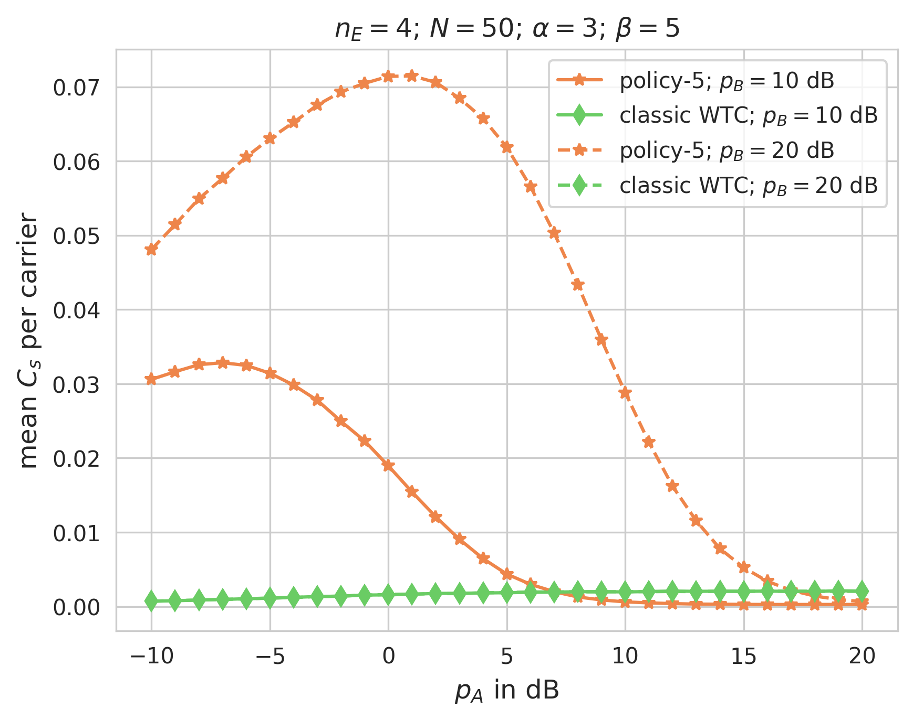
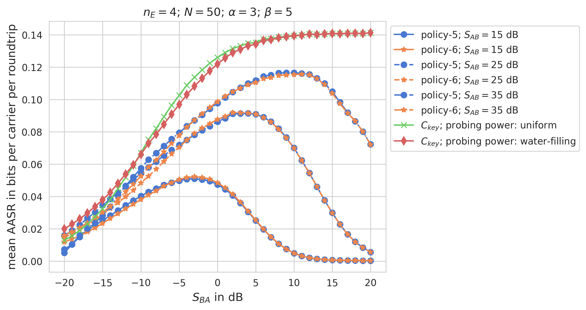
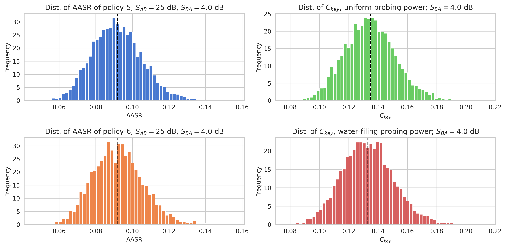

# Secure Multi-Carrier Communication using STEEP (MC-STEEP)

> A. Maksud, *Novel Methods for Wireless Network Security from Continuous Encryption to Information-Theoretic Secret-Key Generation and Beyond*, Ph.D. dissertation, Dept. of Electrical Engineering, University of California, Riverside, Sep. 2024, Chapter 6 (ProQuest 3119493414).
> This chapter has no separate peer-reviewed publication; the dissertation chapter and this repository are the citable artifacts.

<p align="center"></p>
<p align="center"><sub>Alice and Bob exchange over N carriers (probe on h<sub>BA</sub>, echo on h<sub>AB</sub>) while Eve listens with n<sub>E</sub> antennas over g<sub>A</sub>, g<sub>B</sub>.</sub></p>

---

[STEEP](https://ieeexplore.ieee.org/document/11079673) (Secret-message Transmission by Echoing Encrypted Probes) is a two-phase round-trip scheme that reaches a positive secrecy rate over static, non-reciprocal channels.

The mechanism is round trip. In the probing phase Alice broadcasts random probe symbols that Bob and Eve each receive through their own noise; in the echoing phase Bob adds the secret message to his estimate of those probes and sends the sum back to Alice.
Alice sent the probes, so she can subtract them and read the message, whereas Eve must reconstruct the same probes from her noisier observations of both phases.
This turns the round trip into an effective wiretap channel from Bob to Alice that favours the legitimate users, which yields a positive secrecy rate even when Eve's receive channel is stronger than the users' in both directions, provided the echoing power is large enough and Eve's probing-phase reception is not noiseless.

This project studies the multi-carrier (OFDM) extension, because the round trip can separate the probe carrier from the echo carrier, the two carriers can be paired, and the probe/echo power can be scheduled across carriers.
Five pairing and power-scheduling policies are proposed and evaluated against the classic wiretap channel (WTC) and the secret-key capacity `C_key`.
The figure of merit is the average achievable secrecy rate (AASR) in bits per carrier per round trip.

At the project operating point (`n_E = 4`, `N = 50`, `alpha = 3`, `beta = 5`, `S_AB = 20` dB), over 5000 channel realizations echo-power allocation (policy-4) raises the peak AASR of the best pairing policy (policy-2) by about 28% (0.057 to 0.072 bits/carrier); adding probe-power allocation (policy-5) attains the same AASR at about 4 dB lower probing power.
Against a four-antenna eavesdropper the classic WTC secrecy rate is essentially zero (about 0.002 bits/carrier at its best), while policy-5 reaches about 0.07 bits/carrier; its peak AASR rises from ~36% of `C_key` at `S_AB = 15` dB to ~83% at `S_AB = 35` dB as the echoing power grows.

---

## Overview

Two single-antenna nodes, Alice and Bob, communicate in OFDM mode over `N` sub-carriers under flat fading, in the presence of an eavesdropper (Eve) with `n_E` antennas.
All small-scale fading coefficients are i.i.d. standard complex Gaussian $\mathcal{CN}(0,1)$ and the channel is non-reciprocal; the Alice-to-Bob gains $h_{BA}=[h_{BA,1},\dots,h_{BA,N}]$ and the Bob-to-Alice gains $h_{AB}=[h_{AB,1},\dots,h_{AB,N}]$ are independent.
Eve sees $g_{A,n}$ from Alice and $g_{B,n}$ from Bob, each an $n_E$-vector.
Large-scale fading to Eve is $\alpha$ from Alice and $\beta$ from Bob; the Alice-Bob path and all noise powers are normalized to unity.

Writing the per-carrier probing power (Alice) as $p_{A,n}$ and echoing power (Bob) as $p_{B,n}$, the raw SNRs for carrier $n$ are

$$a_n = p_{A,n}\,|h_{BA,n}|^2,\quad b_n = p_{B,n}\,|h_{AB,n}|^2,\quad c_n = \alpha\,p_{A,n}\,\lVert g_{A,n}\rVert^2,\quad d_n = \beta\,p_{B,n}\,\lVert g_{B,n}\rVert^2 .$$

After the round trip a virtual wiretap channel forms from Bob to Alice for the secret message.
The average achievable secrecy rate is

$$C_{s,\text{steep}} = \frac{1}{N}\sum_{n=1}^{N}\left[\log_2\!\left(1+\frac{b_n}{\frac{a_n b_n}{(a_n+1)^2}+2}\right) - \log_2\!\left(1+\frac{d_n}{\frac{d_n a_n (a_n+c_n+1)}{(a_n+1)^2 (c_n+1)}+2}\right)\right]^{+},$$

which is compared against the classic wiretap channel

$$C_{s,\text{classic}} = \frac{1}{N}\sum_{n=1}^{N}\Big\{[\log_2(1+a_n)-\log_2(1+c_n)]^{+} + [\log_2(1+b_n)-\log_2(1+d_n)]^{+}\Big\}$$

and the per-carrier secret-key capacity $C_{key,n}=\log_2\!\big(1+a_n/(1+c_n)\big)$.

In the code, the received-signal powers are named after the link direction: `SBA` is the power received at Bob from Alice (the probing power $p_A$, the x-axis of every sweep) and `SAB` is the power received at Alice from Bob (the echoing power $p_B$).
Expectations over Eve's CSI are taken by Monte-Carlo since a closed form for $C_{s,\text{steep}}$ is not available without Eve's channel.

## Method

```
   phase 1: probe                              phase 2: echo
Alice  --- x_A  over h_BA --->  Bob     Bob  --- x_A_hat + s  over h_AB --->  Alice
  |        (probe)                               (probe estimate               |
  |                                               + secret message)            |
  v                                                                            v
 Eve : y_EA = g_A x_A                                       Eve : y_EB = g_B(x_A_hat + s)
```

1. Alice sends a random probe on carrier $n$; Bob receives $y_{B,n}=h_{BA,n}x_{A,n}+w_{B,n}$ and Eve receives $y_{EA,n}$.
2. Bob forms the estimate $\hat{x}_{A,n}$ and echoes $\hat{x}_{A,n}+s_n$ (probe estimate plus secret message $s_n$); Alice receives $y_{A,n}=h_{AB,n}(\hat{x}_{A,n}+s_n)+w_{A,n}$ and Eve receives $y_{EB,n}$.
3. Pairing chooses which probe carrier feeds which echo carrier: policy-1 keeps the original order; policy-2 sorts both by gain and pairs strongest with strongest; policy-3 pairs strongest probe with weakest echo.
4. Policy-4 allocates the echo power at Bob by solving $\max_{p_{B,n}} C_{s,\text{steep}}$ s.t. $\sum_n p_{B,n}\le N p_B$ through the KKT/bisection routine (Algorithm 3), cutting power from carriers whose secrecy rate would be zero and using the statistics of Eve's CSI for $l_n$.
5. Policy-5 adds probe-power allocation at Alice over the carriers Bob kept active, either uniformly (policy-5) or by water-filling on $|h_{BA,n}|^2$ (policy-6); the two give nearly the same AASR, so the cheaper uniform variant is used.

| Policy | Name | What it does |
|--------|------|--------------|
| policy-1 | no pairing | Pair carriers in original order. Baseline. |
| policy-2 | similar sort | Pair strongest probe with strongest echo. Best pairing-only policy. |
| policy-3 | reverse sort | Pair strongest probe with weakest echo. |
| policy-4 | echo power at Bob | Policy-2 plus KKT echo-power allocation. Raises AASR well above policy-2. |
| policy-5 | + probe power at Alice | Policy-4 plus uniform probe-power allocation. Same AASR as policy-4 at lower probing power. |
| policy-6 | + water-filling probe | Policy-5 with water-filled probe power. Nearly identical to policy-5. |

---

## Results

All figures below are produced by `reproduce_paper.py --preset rich` (5000 channel realizations, dense grids, `n_E=4`, `N=50`, `alpha=3`, `beta=5`).

<table>
<tr>
<td><br><sub>Policies 1,2,3 vs probing power for two echo powers. Policy-2 (similar sort) is best among pairing-only policies.</sub></td>
<td><br><sub>Policies 1,2,3 vs probing power for N=50 and N=100. Carrier count has little effect at large N.</sub></td>
</tr>
<tr>
<td><br><sub>Policy-2 vs policy-4. Echo-power allocation at Bob increases AASR over policy-2.</sub></td>
<td><br><sub>Policies 2,4,5. Policy-5 matches policy-4 AASR while needing less probing power.</sub></td>
</tr>
<tr>
<td><br><sub>Policy-5 AASR for a family of echo powers; the marked locus is the probing-power threshold beyond which AASR falls.</sub></td>
<td><br><sub>Policy-5 vs classic WTC (n_E=4). WTC secrecy vanishes against a strong eavesdropper; policy-5 does not.</sub></td>
</tr>
<tr>
<td><br><sub>Policy-5/6 AASR vs secret-key capacity C_key (uniform and water-filling probing power).</sub></td>
<td><br><sub>Per-realization distributions of AASR (policy-5/6) and C_key at the AASR-maximizing probing power, S_AB=25 dB.</sub></td>
</tr>
</table>

Per-echo-power distributions are also written for `S_AB` = 15 and 35 dB (`results/histogram_p5_p6_ckey_data_SAB_15.png`, `results/histogram_p5_p6_ckey_data_SAB_35.png`).

---

## Repository structure

```
.
├── lib/
│   ├── OFDM_STEEP_2.py   # policies 1-5, pairing, KKT echo-power alloc, classic-WTC rate; backs pplot1-4
│   ├── OFDM_STEEP_3.py   # adds C_key and the policy-5/6/C_key comparisons; backs plot5, plot50, plot5689
│   ├── waterfilling.py   # standalone generalized water-filling helper (see note below)
│   ├── system_model.png  # hero diagram used by the README
│   └── __init__.py
├── results/              # all generated figures (tracked)
├── reproduce_paper.py    # parallel driver that regenerates every figure into results/
├── requirements.txt
└── README.md
```

The two `lib/` modules hold the numerical core; `reproduce_paper.py` calls their functions per grid point in parallel and draws the figures into `results/`.
`lib/OFDM_STEEP_2.py` and `lib/OFDM_STEEP_3.py` are kept as two separate modules rather than merged.
`lib/waterfilling.py` is a standalone generalized water-filling implementation that is not imported by the current code path (both modules use the `cvxpy` water-filling in `power_alloc_classic`); it is kept for reference.

## Reproducing

```bash
pip install -r requirements.txt
python reproduce_paper.py                 # default: R=2000, all figures
python reproduce_paper.py --preset rich   # R=5000, dense grids (the committed figures)
python reproduce_paper.py --preset smoke  # ~10 s end-to-end sanity run
python reproduce_paper.py --only pplot4 plot50 --preset quick
```

`cvxpy` (with the `ecos` solver) is used for the water-filling sub-problems; `cvxpy` and `numpy` are pinned to a numpy<2 stack because the original code relies on numpy-1.x behaviour.

| preset | channel realizations (`R_upper`) | carriers `N` | grid | use |
|--------|----------------------------------|--------------|------|-----|
| smoke  | 3    | 8  | coarse  | end-to-end check in seconds |
| quick  | 60   | 50 | reduced | smooth curves in a couple of minutes |
| full   | 2000 | 50 | full    | paper-level realizations (default) |
| rich   | 5000 | 50 | full    | the committed figures (~14 h on 20 cores) |

Flags: `--preset {smoke,quick,full,rich}`, `--only <phase ...>` (choose from `pplot1 pplot2 pplot3 pplot4 plot5 plot50 plot5689`), `--workers N` (default: all cores), `--dump` (also write the curve arrays as `results/data_*.npz`).
The run is deterministic: each grid point is seeded independently, so the figures do not depend on the number of workers.

## Citation

```bibtex
@phdthesis{
author={Maksud,Ahmed},
year={2024},
title={Novel Methods for Wireless Network Security From Continuous Encryption to Information-Theoretic Secret-Key Generation and Beyond},
journal={ProQuest Dissertations and Theses},
pages={190},
note={Copyright - Database copyright ProQuest LLC; ProQuest does not claim copyright in the individual underlying works; Last updated - 2024-10-23},
isbn={9798896073529},
language={English},
url={https://libproxy.txstate.edu/login?url=https://www.proquest.com/dissertations-theses/novel-methods-wireless-network-security/docview/3119493414/se-2},
}
```
